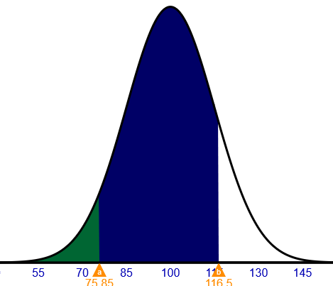

# statistics_apps

# Statistics Applets <!-- omit in toc -->

### A curated repository of applets for learning statistics  <!-- omit in toc -->
#### Always a work in progress (might include incomplete descriptions), but contributions are welcome at any stage! :heart_eyes: 

* [Rossman/Chance Applet Collection](http://www.rossmanchance.com/applets/) by Allan J. Rossman & Beth L. Chance,  Cal Poly - San Luis Obispo (2021).

* [R Shiny Apps for Introductory Applied Statistics (STA 215)](https://facweb.gvsu.edu/adriand1/215apps.html) by Daniel Adrian at the Grand Valley State University.

* [Little Apps for Teaching Stats](http://www.statprep.org/LittleAppSite/#:~:text=Little%20Apps%20are%20tools%20for,graphics%20in%20standard%20web%20browsers.) by Danny Kaplan’s StatPREP program.

* [Introduction to the Book Of Apps for Statistics Teaching](https://shinyapps.science.psu.edu/) by Dennis Pearl (2017-2021) and Neil Hatfield (2019-2021), PennState Eberly College of Science.

* [Statlets](https://www.usu.edu/math/schneit/CTIS/) by Kady Schneiter, Utah State University.

* [whfreeman](http://bcs.whfreeman.com/webpub/statistics/ips9e/9781319013387/statisticalapplets/statisticalapplets.html).

* [Conceptual Learning with Interactive Applets](https://melbapplets.ms.unimelb.edu.au/tag/statistics/) University of Melbourne.

* [Shiny Stats](https://egon.stats.ucl.ac.uk/ug-projects/UCLShinyStats/), University College of London.
